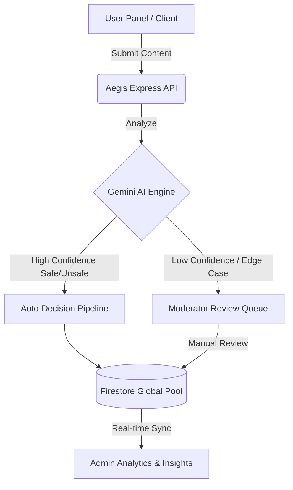

<div align="center">
  
  
  <h1>🛡️ Aegis AI (Shield AI)</h1>
  <p><strong>Advanced Multimodal Content Moderation Platform</strong></p>

  <p>
    <a href="https://sheild-ai-1-0-915x.vercel.app/"></a>
    <a href="https://react.dev/"></a>
    <a href="https://nodejs.org/"></a>
    <a href="https://firebase.google.com/"></a>
    <a href="https://deepmind.google/technologies/gemini/"></a>
  </p>

  <p>
    <a href="https://sheild-ai-1-0.vercel.app/"><strong>View Frontend (Vercel)</strong></a> ·
    <a href="https://sheild-ai-1-0-4.onrender.com"><strong>View Backend API (Render)</strong></a>
  </p>
</div>

<br />

## 📖 Overview

**Aegis AI** is a production-grade, multimodal content moderation platform designed to protect digital communities from harmful content using state-of-the-art artificial intelligence. 

Built with the MERN/Firebase stack and powered by Google's **Gemini 1.5 Flash**, Aegis provides real-time analysis for text, images, audio, and video. It acts as an intelligent shield, identifying and filtering toxic, harmful, or inappropriate content before it reaches your users.

---

## ✨ Key Features

- **🛡️ Multimodal AI Moderation**: Robust, real-time safety analysis for text, images, audio, and video using the Gemini 1.5 model.
- **⚡ Unified 3-Panel Global Sync Architecture**:
  - **User Dashboard**: Users can securely submit content and view real-time safety reports and analysis.
  - **Moderator Panel**: Dedicated workspace for human moderators to review flagged items, add detailed notes, and make final manual decisions.
  - **Admin Overview**: High-level platform-wide analytics, system health monitoring, and moderation usage tracking.
- **🎯 Granular Intelligent Scoring**: Delivers precise severity and confidence scoring across 8+ specialized safety categories (e.g., toxicity, hate speech, explicit content).
- **🔄 Fault-Tolerant Local Fallback Engine**: Features a proprietary, highly-optimized regex-based fallback engine to guarantee 100% moderation uptime, even during AI API outages.
- **🎨 Premium UI/UX**: Designed with a stunning *Midnight Indigo & Amber Glow* aesthetic, featuring glassmorphism elements, fully responsive layouts, and smooth Framer Motion micro-animations.
- **🔒 Secure Authentication**: Integrated Firebase Auth coupled with custom backend JWT middleware to ensure secure session management and role-based access control (RBAC).

---

## 🛠️ Technology Stack

| Category | Technologies |
| :--- | :--- |
| **Frontend** | React 18, Vite, Framer Motion, Tailwind CSS, Recharts, Lucide Icons |
| **Backend** | Node.js (v20), Express.js (Serverless-ready), Zod (Validation), TypeScript |
| **Database** | Google Firebase / Firestore (Real-time NoSQL) |
| **Authentication** | Firebase Auth + Custom JWT Middleware & bcryptjs |
| **AI Engine** | Google Generative AI (Gemini 1.5 Flash) |
| **Deployment** | Vercel (Frontend Hosting), Render (Backend API Hosting) |

---

## 🏗️ System Architecture

Aegis implements a **Global Sync Architecture** to ensure real-time data consistency and high availability across all organizational tiers:



---

## 🚀 Getting Started

Follow these instructions to set up the project locally for development and testing.

### Prerequisites

Ensure you have the following installed on your local machine:
- **Node.js** (v18.x or v20.x recommended)
- **npm** or **yarn**
- A **Firebase Project** & **Google Cloud Project**
- A **Google AI Studio (Gemini) API Key**

---

### 1️⃣ Backend Setup

1. **Navigate to the backend directory:**
   ```bash
   cd functions
   ```
2. **Install dependencies:**
   ```bash
   npm install
   ```
3. **Configure Environment Variables:**
   Create a `.env` file in the `functions` directory and add the following:
   ```env
   GEMINI_API_KEY=your_gemini_api_key_here
   GCLOUD_PROJECT=your_firebase_project_id
   JWT_SECRET=your_super_secure_jwt_secret
   ```
4. **Start the Development Server:**
   ```bash
   npm run dev:server
   ```
   *The API server will launch on `http://localhost:5002` (or the port specified in your setup).*

---

### 2️⃣ Frontend Setup

1. **Navigate to the frontend directory:**
   ```bash
   cd frontend
   ```
2. **Install dependencies:**
   ```bash
   npm install
   ```
3. **Configure Environment Variables:**
   Create a `.env` file in the `frontend` directory and add your Firebase and API configurations:
   ```env
   VITE_API_BASE_URL=http://localhost:5002
   VITE_FIREBASE_API_KEY=your_firebase_api_key
   VITE_FIREBASE_AUTH_DOMAIN=your_project.firebaseapp.com
   VITE_FIREBASE_PROJECT_ID=your_project_id
   VITE_FIREBASE_STORAGE_BUCKET=your_project.appspot.com
   VITE_FIREBASE_MESSAGING_SENDER_ID=your_sender_id
   VITE_FIREBASE_APP_ID=your_app_id
   ```
4. **Start the Frontend Application:**
   ```bash
   npm run dev
   ```
   *The React app will be accessible at `http://localhost:5173`.*

---

## 📂 Project Structure

```text
Sheild-Ai-1.0/
├── frontend/                 # React 18 / Vite Frontend Application
│   ├── src/
│   │   ├── components/       # Reusable UI components (Buttons, Modals, etc.)
│   │   ├── pages/            # Page layouts (Dashboard, Admin, Moderator)
│   │   ├── contexts/         # React Context (Auth, Theme)
│   │   ├── hooks/            # Custom React hooks
│   │   └── lib/              # Utility functions and API clients
│   └── package.json
│
├── functions/                # Node.js / Express Backend & Firebase Functions
│   ├── src/
│   │   ├── ai/               # Gemini AI integration and prompt logic
│   │   ├── api/              # Express API routes (Auth, Content, Moderator)
│   │   ├── middleware/       # JWT Auth and Error handling middleware
│   │   ├── models/           # Types and Zod validation schemas
│   │   └── devServer.ts      # Local Express server entry point
│   ├── .env                  # Backend environment variables
│   └── package.json
│
└── README.md                 # Project documentation
```

---

## 🤝 Contributing

Contributions are what make the open-source community such an amazing place to learn, inspire, and create. Any contributions you make are **greatly appreciated**.

1. Fork the Project
2. Create your Feature Branch (`git checkout -b feature/AmazingFeature`)
3. Commit your Changes (`git commit -m 'Add some AmazingFeature'`)
4. Push to the Branch (`git push origin feature/AmazingFeature`)
5. Open a Pull Request

---

## 📄 License

This project is distributed under the **MIT License**. See the `LICENSE` file for more information.

---

<div align="center">
  <p>Built with ❤️ by <a href="https://github.com/TanishqBhosle">Tanishq Bhosle</a></p>
</div>
