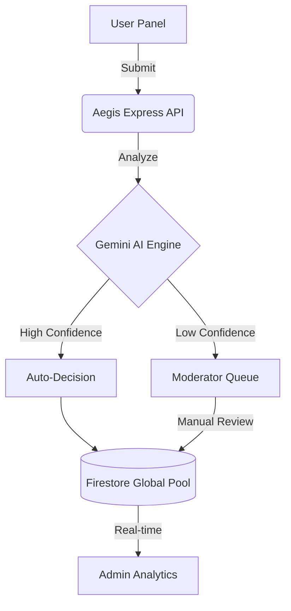

# Aegis AI | Advanced Content Moderation Platform


Aegis AI is a production-grade, multimodal content moderation platform designed to protect digital communities from harmful content using state-of-the-art AI. Built with the MERN stack and powered by Google's Gemini 1.5 Flash, Aegis provides real-time analysis for text, images, audio, and video.

---

## 🌟 Key Features

- **🛡️ Multimodal Moderation**: Real-time safety analysis for text, images, audio, and video using Gemini 1.5.
- **⚡ Unified 3-Panel Sync**:
  - **User Dashboard**: Submit content and view real-time safety reports.
  - **Moderator Panel**: Review flagged items, add notes, and make final decisions.
  - **Admin Overview**: Platform-wide analytics, health monitoring, and usage tracking.
- **🎯 Intelligent Scoring**: Granular severity and confidence scoring across 8+ safety categories.
- **🔄 Local Fallback Engine**: Proprietary regex-based fallback engine ensures 100% uptime even if AI APIs are unavailable.
- **🎨 Premium UI/UX**: Stunning Midnight Indigo & Amber Glow aesthetic with glassmorphism and smooth micro-animations.

---

## 🛠️ Technology Stack

- **Frontend**: React 18, Vite, Framer Motion, Tailwind CSS, Lucide Icons.
- **Backend**: Node.js, Express (Standalone Serverless-ready).
- **Database**: Google Firestore (Real-time NoSQL).
- **Authentication**: Firebase Auth + Custom JWT Middleware.
- **AI Engine**: Google Gemini 1.5 Flash (Advanced multimodal LLM).
- **Deployment**: Vercel (Frontend) + Render (Backend).

---

## 🏗️ System Architecture

Aegis uses a **Global Sync Architecture** to ensure data consistency across all organizational tiers:



---

## 🚀 Getting Started

### Prerequisites
- Node.js 18+
- Firebase Project & Google Cloud Project
- Google AI (Gemini) API Key

### Backend Setup
1. Navigate to the functions directory: `cd functions`
2. Install dependencies: `npm install`
3. Create a `.env` file:
   ```env
   GEMINI_API_KEY=your_key_here
   GCLOUD_PROJECT=your_project_id
   ```
4. Run the development server: `npm run dev:server`

### Frontend Setup
1. Navigate to the frontend directory: `cd frontend`
2. Install dependencies: `npm install`
3. Create a `.env` file:
   ```env
   VITE_API_BASE_URL=http://localhost:5002
   VITE_FIREBASE_API_KEY=your_key
   ... (add all firebase config)
   ```
4. Run the application: `npm run dev`

---

## 📄 License

Distributed under the MIT License. See `LICENSE` for more information.

---

